# 🔥 Configuración de Firebase

## 📋 Pasos para Configurar la Base de Datos

### 1️⃣ Configurar Reglas de Firestore

Para permitir que los scripts funcionen, necesitas actualizar las reglas de Firestore temporalmente:

1. Ve a [Firebase Console](https://console.firebase.google.com/)
2. Selecciona tu proyecto
3. Ve a **Firestore Database** → **Reglas**
4. Actualiza las reglas a:

```javascript
rules_version = '2';
service cloud.firestore {
  match /databases/{database}/documents {
    // TEMPORAL PARA DESARROLLO - Permite lectura/escritura
    match /{document=**} {
      allow read, write: if true;
    }
  }
}
```

**⚠️ IMPORTANTE**: Estas reglas son para desarrollo. Ver sección de seguridad al final.

### 2️⃣ Crear Whitelist Manualmente

En la [Firebase Console](https://console.firebase.google.com/), ve a Firestore Database y crea estos documentos:

#### Colección: `whitelist`

**Documento 1: `rolando_9834_at_gmail_com`**
```json
{
  "organizationId": "aviva-credito",
  "email": "rolando.9834@gmail.com",
  "role": "super_admin",
  "addedBy": "manual-setup",
  "addedAt": [timestamp actual],
  "used": false
}
```

**Documento 2: `admin_at_avivacredito_com`**
```json
{
  "organizationId": "aviva-credito",
  "email": "admin@avivacredito.com",
  "role": "super_admin",
  "addedBy": "manual-setup",
  "addedAt": [timestamp actual],
  "used": false
}
```

**Documento 3-6**: Crea documentos similares para los demás usuarios:
- `capacitador1_at_avivacredito_com` - role: "trainer", assignedKiosko: "ba-product"
- `capacitador2_at_avivacredito_com` - role: "trainer", assignedKiosko: "atn-product"
- `vendedor1_at_avivacredito_com` - role: "seller", assignedKiosko: "ba-product"
- `vendedor2_at_avivacredito_com` - role: "seller", assignedKiosko: "atn-product"

### 3️⃣ Ejecutar Script de Migración de Datos

Una vez que las reglas permitan escritura:

```bash
npx tsx scripts/migrate-to-firestore.ts
```

Este script creará:
- Organización
- 2 Productos (BA y ATN)
- ~100 Preguntas
- Quizzes
- 4 Achievements

### 4️⃣ Probar la Aplicación

1. Inicia la app: `npm run dev`
2. Ve a `http://localhost:9002/login`
3. Inicia sesión con `rolando.9834@gmail.com`
4. El sistema debería:
   - Encontrar tu email en la whitelist
   - Crear tu perfil en la colección `users`
   - Asignarte el rol `super_admin`
   - Darte acceso al panel admin en `/admin`

---

## 🔒 Reglas de Seguridad para Producción

Una vez que todo funcione, actualiza las reglas a:

```javascript
rules_version = '2';
service cloud.firestore {
  match /databases/{database}/documents {

    // Helper function para obtener el rol del usuario
    function getUserRole() {
      return get(/databases/$(database)/documents/users/$(request.auth.uid)).data.rol;
    }

    function isAdmin() {
      return getUserRole() in ['super_admin', 'admin'];
    }

    function isTrainer() {
      return getUserRole() in ['super_admin', 'admin', 'trainer'];
    }

    // Usuarios - solo pueden leer su propio perfil
    match /users/{userId} {
      allow read: if request.auth != null &&
                     (request.auth.uid == userId || isAdmin());
      allow create: if request.auth != null && request.auth.uid == userId;
      allow update, delete: if isAdmin();
    }

    // Whitelist - solo admins
    match /whitelist/{entry} {
      allow read: if request.auth != null;
      allow write: if isAdmin();
    }

    // Organizaciones - solo lectura para autenticados
    match /organizations/{orgId} {
      allow read: if request.auth != null;
      allow write: if isAdmin();
    }

    // Productos - lectura para todos, escritura solo admins
    match /products/{productId} {
      allow read: if request.auth != null;
      allow write: if isAdmin();
    }

    // Preguntas - lectura para todos, escritura solo admins
    match /questions/{questionId} {
      allow read: if request.auth != null;
      allow write: if isAdmin();
    }

    // Quizzes - lectura para todos, escritura solo admins
    match /quizzes/{quizId} {
      allow read: if request.auth != null;
      allow write: if isAdmin();
    }

    // Attempts - usuarios pueden crear sus propios attempts
    match /attempts/{attemptId} {
      allow read: if request.auth != null &&
                     (request.auth.uid == resource.data.userId || isTrainer());
      allow create: if request.auth != null &&
                       request.auth.uid == request.resource.data.userId;
      allow update, delete: if false; // No se pueden modificar
    }

    // Leaderboard - todos pueden leer, usuarios pueden crear
    match /leaderboards/{entryId} {
      allow read: if request.auth != null;
      allow create: if request.auth != null &&
                       request.auth.uid == request.resource.data.userId;
      allow update, delete: if false;
    }

    // Achievements - lectura para todos, escritura solo admins
    match /achievements/{achievementId} {
      allow read: if request.auth != null;
      allow write: if isAdmin();
    }

    // Analytics - solo trainers y admins
    match /analytics/{docId} {
      allow read: if isTrainer();
      allow write: if isAdmin();
    }
  }
}
```

---

## 🎯 Flujo de Autenticación Completo

```mermaid
graph TD
    A[Usuario hace Login con Google] --> B{Email en whitelist?}
    B -->|Sí| C[Obtener rol de whitelist]
    B -->|No| D[Acceso Denegado]
    C --> E{Perfil existe en users?}
    E -->|Sí| F[Cargar perfil existente]
    E -->|No| G[Crear perfil con UID real]
    G --> H[Usar rol de whitelist]
    H --> I[Marcar whitelist como usada]
    I --> F
    F --> J[Usuario accede según rol]
```



---

## ⚡ Alternativa: Usar Firebase Admin SDK

Si los scripts siguen sin funcionar, puedes usar el Firebase Admin SDK que tiene permisos completos:

1. Ve a Firebase Console → Configuración del Proyecto → Cuentas de Servicio
2. Genera una nueva clave privada (archivo JSON)
3. Guárdala como `serviceAccountKey.json` en la raíz del proyecto
4. Actualiza el script para usar Admin SDK:

```typescript
import * as admin from 'firebase-admin';
import serviceAccount from '../serviceAccountKey.json';

admin.initializeApp({
  credential: admin.credential.cert(serviceAccount as any)
});

const db = admin.firestore();
// ... resto del código
```

**⚠️ NUNCA COMMITEES** `serviceAccountKey.json` a git!

---

## 📞 Troubleshooting

### Error: "Permission denied"
- Verifica que las reglas de Firestore permitan escritura
- En desarrollo, usa `allow read, write: if true;`

### Error: "Invalid resource field value"
- Asegúrate de que no haya campos `undefined` en los objetos
- Firestore no acepta valores `null` o `undefined` en algunos campos

### El usuario no puede acceder después de login
1. Verifica que el email esté en la whitelist
2. Verifica que el perfil se creó en la colección `users`
3. Revisa la consola del navegador para errores

### Script se cuelga o no responde
- Verifica las credenciales de Firebase en `.env.local`
- Asegúrate de que el proyecto de Firebase tenga Firestore habilitado
- Verifica que las reglas de Firestore permitan escritura

---

## 📚 Recursos

- [Firebase Console](https://console.firebase.google.com/)
- [Documentación de Firestore](https://firebase.google.com/docs/firestore)
- [Reglas de Seguridad](https://firebase.google.com/docs/firestore/security/get-started)
- [Firebase Admin SDK](https://firebase.google.com/docs/admin/setup)
